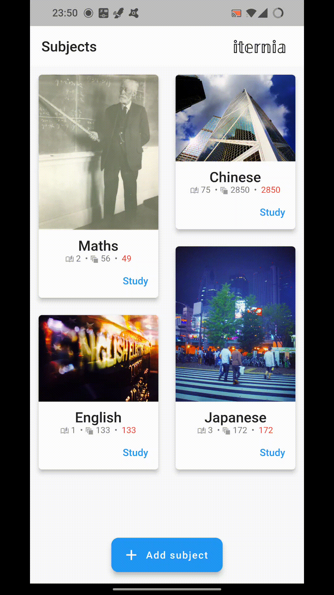

# Iternia - Flashcard SR App

This is an educational project, the app is written in dart using Flutter. My goal was to get something up and running in less then a week, forcing myself to stay focused on the essentials and developing a "get it shipped" attitude to increase efficiency/productivity.

Used concepts:
- Dart (basics, null safety, project setups, ...)
- Flutter, build-gen
- Design of UIs
- Time/Resource-oriented development


## Implemented Features
Iternia Flashcard offers a simple spaced repetition system and access to subjects, decks per subject and cards per deck. Data is stored locally. 


### Data Storage
Data is stored locally, subdivided into Subjects, Decks and Cards. Each subject can have parameters that define its spread in the spaced repetition algorithm per correct/incorrect answer.




### Swiped Learning
When learning, swiping left/right is a negative/positive feedback respectively. Swiping up indicates an easy card that can be reviewed even later.

<br>

### Theming & Localization
The app automatically adjusts to different countries, different themes are available.


## Build
```shell
flutter pub get
flutter pub run build_runner build
```

#### Debug Builds:
```shell
flutter build apk --debug --split-per-abi     # android
flutter build web -d <browser>                # web
```

#### Release Builds:
```shell
flutter build apk --release --split-per-abi   # android
flutter build web --release                   # web
```
